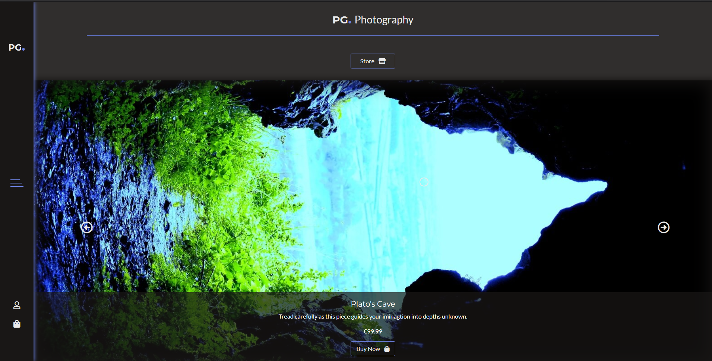

# PG Photography
#### Code Institute Full Stack Development Project
 
<p align="center">
  
</p>
 
<p align="center"><a href="https://pg-photography.herokuapp.com/" target = "_blank">PG Photography</a></p>
 
## Table of Contents
 
- [**About**](#About)
- [**UX**](#UX)
    - [User Stories](#User-Stories)
    - [UI](#ui)
    - [Design](#Design)
    - [Database Schema](#database-schema)
    - [Database Model](#database-model)
    - [Wireframes](#Wireframes)
- [**Features**](#Features)
    - [Future features](#Future-updates)
- [**Technologies used**](#Technologies-used)
- [**Testing**](#Testing)
    - [Manual testing](#Testing)
    - [Errors](#Errors)
- [**Code Notes**](#Code-Notes)
- [**Deployment**](#Deployment)
- [**Credits**](#Deployment)
    - [Code](#Code)
    - [Images](#Images)
- [**Acknowledgements**](#Acknowledgements)


## About

The purpose of this project was to build a functioning e-commerce site to sell photographs taken by thw owner with test payments via [Stripe](https://stripe.com/).

The site allows users to create an account and save billing information although it's not necesarry to create an account to checkout, it does provide a convinience for repeat custom if the user chooses to do so. The site also allows social logins from three popular vendors for a convinient way to create an account.

 
## UX


### User Stories
<a href="read_me_assets/user_stories.pdf" target="_blank">User Stories PDF</a>
 
### UI

* I decided to go against the grain with the navbar on this site and go for a bottom aligned navbar for mobile and a left aligned navbar on bigger devices.<br> My reasoning for this is, with mobile devices constantly getting bigger, i feel having a navbar along the top is quite awkward to use if the device is particularly tall, having the navbar aligned along the bottom will allow for much easier one-handed use. The left aligned navbar on bigger devices is because i feel that navbars that span the whole width of the screen are intrusive and come in the way of the pages content.

* There is a category selector in the store which allows the user to filter from available categories. Coupled with a paginator allows for a neat viewing experience.
* There is a contact page which allows the user to send a message straight the to owners onsite inbox. This page also displays the about information that hold relevant information about the site owner, and when setup will also house social links.
* A signup/login form with social logins from three popular vendors.
* A loading page was implemented due to alot of images being used on the website to stop poor impressions from unloaded images. There is also a loading buffer when processing payments.
* The site makes use of messages to give users real time feedback on their actions.
 
### Design

* The design of this page is intended to be simplistic but eye catching using these colours:
    - Main colour: #191716
    - Font colour: #eaeaea
    - Secondary colour: #6a7fdb
    - The inspiration for the dark colours used on this site stem from a photographers dark room.
* The mouse cursor for this site is a circle, reminisent of a camera lense, that expands when hovering over a link.
* Links and buttons have a hover effect.


### Database Schema
<details>
<summary>
Schema table
</summary>

1. <strong>UserProfile</strong>

<table>
    <tr>
        <th>id</th>
        <th>User</th>
        <th>default_phone_number</th>
        <th>default_street_address1</th>
        <th>default_street_address2</th>
        <th>default_town_or_city</th>
        <th>default_county</th>
        <th>default_postcode</th>
        <th>default_country</th>
    </tr>
    <tr>
        <td>INT</td>
        <td>ForeignKey</td>
        <td>CharField</td>
        <td>CharField</td>
        <td>CharField</td>
        <td>CharField</td>
        <td>CharField</td>
        <td>CharField</td>
        <td>CountryField</td>
    </tr>
</table>

2. <strong>Order</strong>

<table>
    <tr>
        <th>id</th>
        <th>date</th>
        <th>delivery_cost</th>
        <th>order_total</th>
        <th>grand_total</th>
        <th>original_bag</th>
        <th>dispatched</th>
        <th>email_sent</th>
        <th>UserProfile</th>
        <th>order_number</th>
        <th>full_name</th>
        <th>email</th>
        <th>phone_number</th>
    </tr>
    <tr>
        <td>INT</td>
        <td>DateField</td>
        <td>INT</td>
        <td>INT</td>
        <td>INT</td>
        <td>TextField</td>
        <td>BooleanField</td>
        <td>BooleanField</td>
        <td>ForeignKey</td>
        <td>CharField</td>
        <td>CharField</td>
        <td>EmailField</td>
        <td>CharField</td>
    </tr>
</table>
<table>
    <tr>
        <th>country</th>
        <th>postcode</th>
        <th>town_or_city</th>
        <th>street_address1</th>
        <th>street_address2</th>
        <th>county</th>
        <th>stripe_pid</th>
    </tr>
    <tr>
        <td>CountryField</td>
        <td>CharField</td>
        <td>CharField</td>
        <td>CharField</td>
        <td>CharField</td>
        <td>CharField</td>
        <td>CharField</td>
    </tr>
</table>

3. <strong>Products</strong>

<table>
    <tr>
        <th>id</th>
        <th>name</th>
        <th>price</th>
        <th>sku</th>
        <th>description</th>
        <th>image</th>
        <th>category</th>
    </tr>
    <tr>
        <td>INT</td>
        <td>CharField</td>
        <td>INT</td>
        <td>CharField</td>
        <td>TextField</td>
        <td>ImageField</td>
        <td>ForeignKey</td>
    </tr>
</table>

4. <strong>Category</strong>

<table>
    <tr>
        <th>id</th>
        <th>name</th>
        <th>friendly_name</th>
    </tr>
    <tr>
        <td>INT</td>
        <td>CharField</td>
        <td>CharField</td>
    </tr>
</table>

5. <strong>OrderLineItem</strong>

<table>
    <tr>
        <th>id</th>
        <th>quantity</th>
        <th>lineitem_total</th>
        <th>product</th>
        <th>order</th>
        <th>size</th>
        <th>colour</th>
        <th>material</th>
    </tr>
    <tr>
        <td>INT</td>
        <td>INT</td>
        <td>INT</td>
        <td>ForeignKey</td>
        <td>ForeignKey</td>
        <td>ForeignKey</td>
        <td>ForeignKey</td>
        <td>ForeignKey</td>
    </tr>
</table>

6. <strong>Inbox</strong>

<table>
    <tr>
        <th>id</th>
        <th>name</th>
        <th>email</th>
        <th>subject</th>
        <th>enquiry</th>
        <th>date_sent</th>
        <th>mark_as_read</th>
    </tr>
    <tr>
        <td>INT</td>
        <td>CharField</td>
        <td>EmailField</td>
        <td>CharField</td>
        <td>TextField</td>
        <td>DateTimeField</td>
        <td>BooleanField</td>
    </tr>
</table>

7. <storng>Size</storng>

<table>
    <tr>
        <th>id</th>
        <th>value</th>
    </tr>
    <tr>
        <td>INT</td>
        <td>CharField</td>
    </tr>
</table>

8. <strong>Colour</strong>

<table>
    <tr>
        <th>id</th>
        <th>name</th>
    </tr>
    <tr>
        <td>INT</td>
        <td>CharField</td>
    </tr>
</table>

9. <strong>Material</strong>

<table>
    <tr>
        <th>id</th>
        <th>value</th>
    </tr>
    <tr>
        <td>INT</td>
        <td>CharField</td>
    </tr>
</table>
</details>

### Database Model

* <a href="read_me_assets/database_model.pdf" target="_blank">Database Model</a>

### Wireframes
The Wireframes are my initial idea for the website, the final product is very similar to these wireframes, however there are a few changes, most notably the home page and the colour scheme.
* <a href="read_me_assets/wireframes.pdf" target="_blank">Wireframes</a>
 
 
## Features

* Ability to Signup/login.
* Ability to browse the stores products, with optional filtering.
* Ability to add items to bag.
* Ability to edit items in the bag.
* Ability to delete items in the bag.
* Ability to purchase items in the bag.(Currently only with test payments, details [here](https://stripe.com/docs/testing))
* A loading page.
* Customised 404 and 500 error pages with automatic redirect.
* The project contains a few security features, such as:
   - validating login.
   - hashing passwords.
   - environment variables are hidden.
   - debug is turned off in the production version.
   - secure payments via [Stripe](https://stripe.com/) - Test payments only
* Custom built admin tools
    - Ability to add, edit and delete products.
    - Ability to access on-site inbox, with messages sent from users. Option to mark message as read.
    - Ability to access orders that have been placed and edit them, and mark order as dispatched which fires off an email to the user.
* User Profiles
    - Ability to store delivery information.
    - Access Order History.
    - Change password and Logout

 
###  Future updates
 
-  **User Reviews** Ability to add reviews from multiple users to a product.
-  **Real Payments** Ability to process real payments.
-  **Social Links** Addition of social links to the about section once the owner has launched his business.
 
## Technologies used

Below I have listed the programming languages, technologies, frameworks and resources used for this project.
 
* **HTML5**
* **CSS3**
* **[SASS](https://sass-lang.com/)**
* **Vanilla JS**
* **J Query**
* **Markdown**
* **Python**
* **Git** for version control.
* **[Github](https://github.com/)** to hold my project.
* **[Heroku](https://heroku.com/)** to deploy my project to the web.
* **[Django](https://www.djangoproject.com/)**
* **[FontAwesome](https://fontawesome.com/)** for icons.
* **SQLite3/Postgres**
* **Google Chrome/FireFox/Edge/Safari** 
* **Developer tools for chrome/FireFox/Edge**
* **[Amiresponsive](http://ami.responsivedesign.is/)**
* **[Balsamiq](https://balsamiq.com/)** to create wireframes.
* **[W3Schools](https://www.w3schools.com/)** for help with some issues i ran into
* **[StackOverFlow](https://stackoverflow.com/)** for help with some issues i ran into
* **Mentor** my code institute mentor for advice
* **[Slack](https://slack.com/)** specifically the code institute room in slack.
* **[Grammarly](https://www.grammarly.com/)** to correct grammar and spelling mistakes.
* **[MySQL Workbench](https://www.mysql.com/products/workbench/)** to design and visualize my database.
 
## Testing

* [HTML validator](https://validator.w3.org/#validate_by_input)
* [CSS validator](https://jigsaw.w3.org/css-validator/#validate_by_input)
* [JsHint](https://jshint.com)
* Testing [checklist](https://geteasyqa.com/qa/test-website/)
* [pep8](http://pep8online.com/)
 
I personally tested the website on some of my own personal systems of which include:
 
* MSI gaming laptop running windows 10 
* Acer aspire windows 7 laptop
* HP Windows Vista desktop
* Custom built windows 7 high-end Gaming Desktop
* Samsung galaxy s5/s6/s7/s9/s20 (Android) phones
* Samsung Galaxy Tab A6 Tablet (Android).
 
The website from my testing is compatible on multiple browsers.

I had family and friends test the website also.
 
### Manual testing
<details>
<summary>
Testing conducted
</summary>

#### Non Superuser Accounts/Non verified

* Create an account, works as it should, passwords are hashed for security. &#9745;
* Logging in to the created account, works as it should. &#9745;
* Change password works. &#9745;
* Adding a product to bag, works as it should. &#9745;
* Editing a product in the bag, works as it should &#9745;
* Removing a product from the bag, works as it should. &#9745;
* Logout button visible in nav if the user is logged in. &#9745;
* Login and Signup buttons are only visible if you are not signed in. &#9745;
* If the username/email already exists in the database, prompts the user that it already exists. &#9745;
* All links work. &#9745;
* Flash messages appear when appropriate to ensure completed action to the user, or if errors occur. &#9745;
* Form validation is used to help prevent any errors that may arrise from incomplete/incorrecy data. &#9745;
* Custom 404 error page with redirect after 10 seconds. &#9745;
* Custom 505 error page with redirect after 10 seconds. &#9745;
* Delete modal failsafe works. &#9745;
* Checkout works as expected with verification E-mail and form autofill if user logged in and user info stored. &#9745;
* Checkout and item totals calculate correctly. &#9745;
* Contact works as expected with form autofil if logged in and user info stored. &#9745;
* Userprofiles work as expected including updating of user information and order history. &#9745;
* Pagination works. &#9745;
* Image carousel works and displays relevant information. &#9745;


#### Superuser Accounts

* Admin tools visible in nav if logged in. &#9745;
    - Add Product, works as it should. &#9745;
    - Edit Product, works as it should. &#9745;
    - Delete Product, works as it should. &#9745;
    - Inbox, works as it should, with mark as read functionality. &#9745;
    - Order, works as it should, with mark as dispatched functionality. &#9745;
* Correct data is displayed for each field in edit form. &#9745;
* Link to admin panel only appears in superuser profiles. &#9745;
 
No automated testing was conducted.
</details>
 
### Errors
<details>
<summary>
Current errors:
</summary>
 
1. ~~ ***NOT YET FIXED*** Forgot to add spaces to messages after conforming to pep8 styling ~~ &#9745;
2. ~~ ***NOT YET FIXED*** No link to go back to inbox from message page. ~~ &#9745;
3.  ~~ ***NOT YET FIXED*** Wrong total being displayed on checkout success page. ~~ &#9745;
4. ~~ ***NOT YET FIXED*** Orders not working correctly, only processing first item in the bag. ~~ &#9745;
5. ~~ ***NOT YET FIXED*** Update/Remove links not working on bag page. ~~ &#9745;
6.  ~~ ***NOT YET FIXED*** Fix positioning of admintools on page. ~~ &#9745;
7. ~~ ***NOT YET FIXED*** Checkout Success not displaying all items bought. ~~ RELATED TO ORDERS FIX &#9745;
8. ~~ ***NOT YET FIXED*** Back link on product detail page returns to store no matter where it'c accessed from. ~~&#9745;
9. ~~ ***NOT YET FIXED*** Add margin to bottom of login page. ~~ &#9745;
10. ~~ ***NOT YET FIXED*** Images need compressing causing slow load times. ~~ &#9745;
11. ~~ ***NOT YET FIXED*** Fix quantity inputs on bag page allowing out of intended range values. ~~&#9745;
12. ~~ ***NOT YET FIXED*** +/- buttons not working correctly if multiple of the same item are in the bag due to duplicated item ID's. ~~&#9745;
13. ~~ ***NOT YET FIXED*** Disable right click context menu for images to try prevent saving images. ~~&#9745;
14. ~~ ***NOT YET FIXED*** Social logins not working, issue with callback urls coming from non secure origin. ~~&#9745;
15. ~~ ***NOT YET FIXED*** Move content in product cards up for mobile. ~~&#9745;
16. ~~ ***NOT YET FIXED*** +/- buttons appearing over nav on mobile due to ::focus attribute increasing z-index. ~~&#9745;
17. ~~ ***NOT YET FIXED*** If username is too long, will push heading off the page on userprofile page. ~~&#9745;
18. ***NOT YET FIXED*** Menu goes white on firefox browser on mobile. Issue with toolbar hiding, issue goes away when turned off in browser settings.
19. ~~ ***NOT YET FIXED*** Gap on userprofile page between orders and account services on mobile. gap narrowed ~~ &#9745;
20. ~~ ***NOT YET FIXED*** Server error when checking out on live site. ~~ &#9745; Forgotten about print statements
21. ~~ ***NOT YET FIXED*** Issue with nav links appearing when background is clicked, caused by out of place js. ~~&#9745;
22. ~~ ***NOT YET FIXED*** Clicking cancel on delete modal doesn't close the modal. ~~&#9745;
23. ~~ ***NOT YET FIXED*** If delivery info isn't set None displaying on profile. ~~&#9745;
24. ***NOT YET FIXED*** Not able to checkout more than 4 items at a time, a restriction with stripe only allowing 500 characters in the metadata.
</details>

## Code Notes

 - Some warnings/errors occuring with linter which i can't stop from being flagged.

## Deployment

<details>
<summary>
Deployment
</summary>

To deploy this project I used [Heroku](https://dashboard.heroku.com/)

**The final version of the application was deployed using Heroku:**   
**[here](https://pg-photography.herokuapp.com/)**

The deployed version is the same version as in the repository.

The following steps were used for deployment on Heroku:

1. In Gitpod CLI, in the root directory of the project, run 

   `pip3 freeze --local > requirements.txt`

   to create a `requirements.txt` file containing project dependencies.

2. In the Gitpod project workspace root directory, create a new file called Procfile, with capital 'P'.  
   Open the Procfile. Inside the file, enter:  

   `web: python3 app.py`

    Save the file.

3. **Make sure you do a Git commit after creating the requirements.txt and the Procfile.**

4. On [Heroku](https://www.heroku.com/), sign in using your username and password.

5. On Heroku Dashboard, press the "New" button, then select "Create new app".

6. Enter the name of your app and select your region.   
   Press "Create app".

7. On Heroku App Dashboard, go to Resources tab, add Heroku Postgres and select the free Hobby Dev option

8. In Gitpod workspace CLI, in the project's root directory, enter  

    `pip3 install dj-database-url` and `pip3 install gunicorn` to install dj-database-url and gunicorn respectively

9.  Still in the CLI, enter
    `pip3 freeze --local > requirements.txt` again to update requirements file and then
    `git commit -m "{your message here}"` and `git push`

10. Back to heroku again, in the Settings tab, click the button "Reveal Config vars", add the following:
    -   key: `DATABASE_URL`
        value: `{postgres url}`
    -   key: `USE_AWS`
        value: `True`
    -   key: `AWS_ACCESS_KEY_ID`
        value: `{Value}`
    -   key: `AWS_SECRET_ACCESS_KEY`
        value: `{Value}`
    -   key: `DJANGO_SECRET_KEY`
        value: `{Value}`
    -   key: `EMAIL_HOST_PASS`
        value: `{Value}`
    -   key: `EMAIL_HOST_USER`
        value: `{Value}`
    -   key: `STRIPE_PUBLIC_KEY`
        value: `{Value}`
    -   key: `STRIPE_SECRET_KEY`
        value: `{Value}`
    -   key: `STRIPE_WH_SECRET`
        value: `{Value}`
    -   key: `DISABLE_COLLECT_STATCIC`
        value: `1`

11. In settings.py of your main project folder do the following: 
    At the top of the file add:
    `import os` and `import dj_databsae_url`

    Change `DEBUG = True` to:
```python
    if 'DEVELOPEMENT' in os.environ:
        DEBUG = True
    else:
        DEBUG = False
```

    ALSO add the following under databases:

```python
    if 'DATABASE_URL' in os.environ:
    DATABASES = {
            'default': dj_database_url.parse(os.environ.get('DATABASE_URL'))
    }
else:
    DATABASES = {
        'default': {
            'ENGINE': 'django.db.backends.sqlite3',
            'NAME': os.path.join(BASE_DIR, 'db.sqlite3'),
        }
    }
 ```

    ALSO add the following under static files:

```python
    
    if 'USE_AWS' in os.environ:
        # Cache Control
        AWS_S3_OBJECT_PARAMETERS = {
            'Expires': 'Thu, 31 Dec 2099 20:00:00 GMT',
            'CacheControl': 'max-age=94608000',
        }

        # Bucket Config
        AWS_STORAGE_BUCKET_NAME = 'pg-photography'
        AWS_S3_REGION_NAME = 'eu-west-1'
        AWS_ACCESS_KEY_ID = os.environ.get('AWS_ACCESS_KEY_ID')
        AWS_SECRET_ACCESS_KEY = os.environ.get('AWS_SECRET_ACCESS_KEY')
        AWS_S3_CUSTOM_DOMAIN = f'{AWS_STORAGE_BUCKET_NAME}.s3.amazonaws.com'

        # Static and media files
        STATICFILES_STORAGE = 'custom_storages.StaticStorage'
        STATICFILES_LOCATION = 'static'
        DEFAULT_FILE_STORAGE = 'custom_storages.MediaStorage'
        MEDIAFILES_LOCATION = 'media'

        # Override static and media URLs in production

        STATIC_URL = f'https://{AWS_S3_CUSTOM_DOMAIN}/{STATICFILES_LOCATION}/'
        MEDIA_URL = f'https://{AWS_S3_CUSTOM_DOMAIN}/{MEDIAFILES_LOCATION}/'
```

    ALSO add the following at the bottom of the file:
```python
    STRIPE_CURRENCY = 'eur'
    STRIPE_PUBLIC_KEY = os.getenv('STRIPE_PUBLIC_KEY', '')
    STRIPE_SECRET_KEY = os.getenv('STRIPE_SECRET_KEY', '')
    STRIPE_WH_SECRET = os.getenv('STRIPE_WH_SECRET', '')


if 'DEVELOPEMENT' in os.environ:
    EMAIL_BACKEND = 'django.core.mail.backends.console.EmailBackend'
    DEFAULT_FROM_EMAIL = 'PGPhotography@gmail.com'
else:
    EMAIL_BACKEND = 'django.core.mail.backends.smtp.EmailBackend'
    EMAIL_USE_TLS = True
    EMAIL_PORT = 587
    EMAIL_HOST = 'smtp.gmail.com'
    EMAIL_HOST_USER = os.environ.get('EMAIL_HOST_USER')
    EMAIL_HOST_PASSWORD = os.environ.get('EMAIL_HOST_PASS')
    DEFAULT_FROM_EMAIL = os.environ.get('EMAIL_HOST_USER')
```

12. Back in the GitPod workspace and in the Procfile:
    `web: gunicorn PG_Photography.wsgi:application`

13. in settings.py again set:
    `ALLOWED_HOSTS = ['pg-photography.herokuapp.com', 'localhost']`
    Just below the DEBUG Variable

14. In the terminal run `python3 manage.py collectstatic`

15. Back on the Heroku Dashboard navigate to the Deploy tab and select GitHub as the deployment method.
    Add current repo and click connect.

16. Commit and push all changes to GitHub/Heroku.

17. The app is now deployed to Heroku.
</details>

### Local Deployment
<details>
<summary>
If you want to run this project locally, you will need to follow these steps.
</summary>

Requirements:
    1. A Developement Environment with the following installed:
        python3 and pip
    2. Have a Gmail Account with 2F authentication enabled
    3. Have a free stripe account.

1. Clone or download this repository.

2. Upload the repository into your IDE of choice.  

I used Gitpod for development, so the following steps will be specific to Gitpod. You will need to adjust them depending on your IDE.

3. In your workspace CLI, run

   `pip3 install -r requirements.txt`

   to install the project-required dependencies.

4. You will need to set any keys or addresses to your own.

5. In the CLI run `python3 manage.py makemigrations`
    and then `python3 manage.py migrate`

6. Create a superuser by running `python3 manage.py createsuperuser`
    follow the prompts to create a superuser

7. You can now run the application by typing the following `python3 manage.py runserver`

8. 
</details>
 
## Credits
### Code
* A useful guide i used to learn how to use the Inline Form Set Factory [here](https://www.youtube.com/watch?v=JIvJL1HizP4&t=551s)
* I found a template for this README in one of the channels in slack, however i can no longer remember where it was to credit the user who posted it.


### Images

* All Images were provided by the owner.
 

## Acknowledgements
 
A thank you to my friends and family for testing the game for me.
Also a thank you to my mentor for the help and support.
 
[Back to top ↑](#pg-photography)

